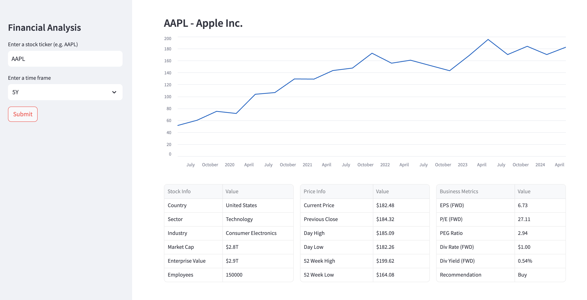

# Financial-Data-Analysis-Dashboard
This is a simple [Streamlit](https://streamlit.io/) web app that fetches and displays **real-time and historical stock data** using the Yahoo Finance API.

### ✨ Features
- Fetch detailed stock ticker information (sector, industry, market cap, enterprise value, employees)
- Plot interactive historical price charts (1D, 5D, 1M, 6M, YTD, 1Y, 5Y)
- Display key price metrics (current price, day high/low, 52-week high/low)
- Show key business metrics (EPS, P/E, PEG, dividend rate & yield, recommendation)
- Show earnings moves for last 12 quarters
- Responsive design with data tables and interactive charts
- No API key required—uses Yahoo Finance via `yfinance`




### ⏩ Quick Start
1. Clone this repo.
```bash
  git clone https://github.com/alphasecio/streamlit-yfinance.git
  cd streamlit-yfinance
```
2. Install dependencies.
```bash
  pip install -r requirements.txt
```
3. Run the app.
```bash
  streamlit run streamlit_app.py
```
